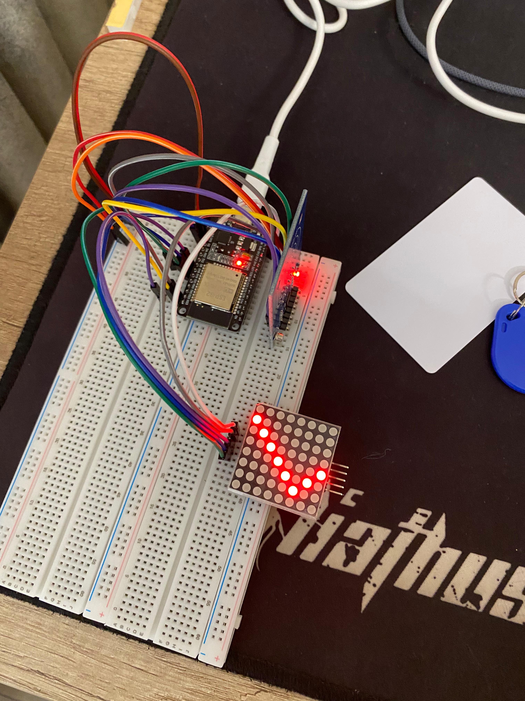
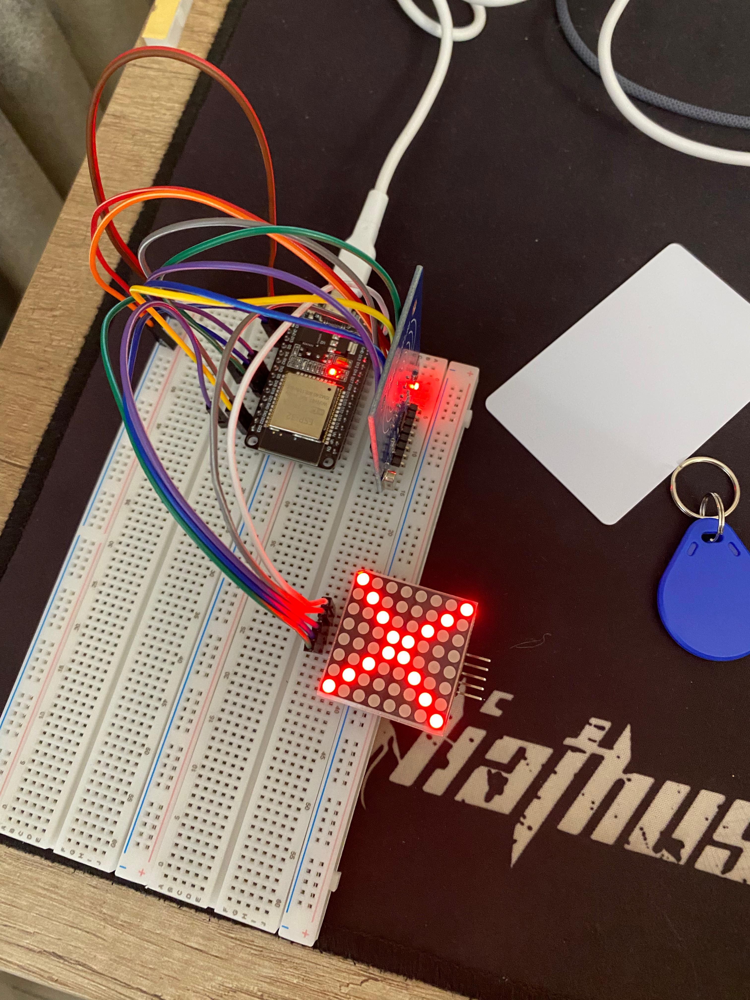

# RFID Controlled LED Matrix (Tick / Cross)

In this project, an **MFRC522 RFID reader** and a **MAX7219 8x8 LED Matrix** are used to display a **✔ (tick)** or **✖ (cross)** on the matrix depending on the scanned card.

---

## 📦 Hardware Used
- ESP32
- MFRC522 RFID Reader
- MAX7219 8x8 LED Matrix
- Jumper wires

---

## ⚙️ Working Principle
- An RFID card is scanned
- The card UID is read
- If the UID is authorized, a ✔ is displayed on the LED matrix
- If the UID is not authorized, a ✖ is displayed
- The display is cleared after 2 seconds

---

## 🧠 Libraries Used
- `MFRC522`
- `MD_MAX72XX`
- `SPI`

---

## 🖼️ Project Images

### ✔ Authorized Card (Tick)

### ✖ Unauthorized Card (Cross)

---

## 🚀 Notes
- UID comparison is done directly in the code
- LED matrix orientation is corrected in software
- Compatible with FC-16 type MAX7219 modules

---

## 📌 Future Improvements
- Adding multiple authorized cards
- Buzzer or relay control
- OLED or TFT display integration
